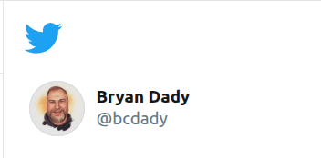

I created twitter.com/bcdady on May 20, 2009. I wish I recalled what I was doing that prompted me to sign up then. It took me a few years to figure out what I wanted to do with it, and to learn how to most effectively interact with the various communities. 

My first tweet was:

> washing baby bottles and pondering the extent of love for my 16 lb, uncoordinated, limited dialog, beautiful bundle of joy

This used 122 of the original allowed 140 characters. My firstborn (daughter) was just 145 days (a.k.a. 4 months, 24 days) old. In May 2009, we were living in Kenmore, WA and I was approaching the end of my contract with J.P. Morgan Chase, related to their FDIC facilitated takeover of Washington Mutual bank.

My final tweet posted on Dec 18, 2022:

> I’m signing off and deleting this app. The exhaustion and tedium of the diva CEO has overwhelmed the benefits (communication and community) I once enjoyed. If you’d like to stay connected, I’m still available on @LinkedIn and open to trying out Mastodon (bcdady@ioc.exchange)

<!-- truncate -->

Across my 14-year Twitter journey, I sent 7,124 other tweets and Liked 4,099 others.

I created 14 Lists, covering topics ranging from "people i know", placed I lived, sports, and numerous professional and technology related themes.

The PowerShell community, some employed at Microsoft, and many others in the Microsoft #MVP program was the most rewarding to be apart of. This is reflected in my #1 all-time hashtag.  

The 2015-2016 peak showing your most active community engagement period

The strong Montana connections and local tech community involvement

investigate peak in August 2010 with 163 tweets!

It's a great snapshot of how your online presence evolved alongside your career in DevOps/SRE and your involvement in the tech community. The analysis shows you were much more than just a casual user - you were actively contributing to conversations and building professional relationships through the platform.
